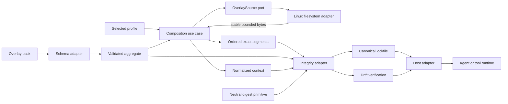
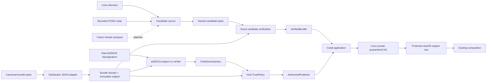

# Architecture

## Mental model

Invokrum has two deliberately separate pipelines.

### Composition

```text
pack + profile + overlay files
                    │
                    ▼
          parse and normalize
                    │
                    ▼
       validate structure and rules
                    │
                    ▼
        resolve canonical ordering
                    │
                    ▼
       load stable bounded bytes
                    │
                    ▼
 normalized context + resolved manifest
                    │
                    ▼
 canonical evidence + versioned lockfile
```

Composition validates declared structure and integrity. It does not execute agents, authorize runtime actions, perform implicit acquisition, or decide whether prompt text is semantically trustworthy.

### Acquisition, publisher trust, and installation

```text
local directory / bounded POSIX ustar / future remote transport
                    │
                    ▼
             exact candidate bytes
                    │
                    ▼
         immutable bundle verification
                    │
          +---------+---------+
          │                   │
          │            ed25519-subject-v1
          │                   │
          │            PublisherAssertion
          │                   │
          │              host TrustPolicy
          │                   │
          │            AuthorizedPublisher
          │                   │
          +---------+---------+
                    │
                    ▼
       Linux private quarantine / CAS
                    │
                    ▼
      versioned installation evidence
                    │
                    ▼
        protected local pack root
                    │
                    ▼
          ordinary composition
```

The supported local directory/archive path is implemented through authenticated and unauthenticated installation evidence. Remote/network transport, registry discovery, freshness/revocation/transparency, and rollback-selection policy remain future outer-layer concerns.

## Dependency direction

Dependencies point inward. Core composition has no filesystem, process, network, environment, clock, randomness, hashing, or serialization dependency.

Composition:

```text
invokrum-cli / invokrum-host
       ↓          ↓          ↓
 schema adapter  fs adapter  integrity adapter
       └──────────┴──────────┘
                  ↓
           invokrum-core

invokrum-integrity ──> invokrum-digest
```

Distribution/acquisition/install:

```text
CLI / host delivery (install surface pending #64)
                     ↓
             invokrum-install
             ↙      ↓       ↘
 acquisition   distribution   verifier port
    ↓              ↓              ↓
linux/archive  distribution-json  verifier-ed25519
    ↓              ↓              ↓
 filesystem       digest       crypto provider
                     ↓
            invokrum-install-linux
```

The distribution and composition domains do not depend on each other. They may share dependency-free primitives such as `invokrum-digest` without creating policy coupling.

## Component boundaries

### `invokrum-core`

Owns parsing-neutral domain values, deterministic aggregate validation, compatibility rules, the application-owned `OverlaySource` port, deterministic composition, resource limits, ordered exact-byte segments, normalized context bytes, resolved manifest values, and stable operation errors.

It must not depend on Serde, YAML/JSON libraries, filesystem implementations, hashing implementations, distribution policy, signing providers, registries, Anthesis, or a host runtime. Composition is tested with in-memory adapters.

### `invokrum-schema`

Owns strict YAML/JSON decoding, schema-family negotiation, duplicate and unknown-field rejection, the accepted YAML subset, DTO translation, normalized JSON, and JSON Schema alignment. It depends inward on `invokrum-core` and performs no filesystem access.

### `invokrum-fs`

Implements `OverlaySource` for local Linux files. It establishes and pins a canonical root, rejects links and filesystem device changes, verifies opened-file containment and identity, and returns bytes from one bounded stable read. Same-device bind mounts are excluded by the documented host namespace precondition rather than claimed as automatically detectable. The adapter depends inward on `invokrum-core` and does not parse schemas or select overlays.

The exact platform and namespace contract is documented in [deterministic composition and filesystem contract](../composition-and-filesystem.md).

### `invokrum-digest`

Owns dependency-free deterministic digest primitives shared across otherwise independent boundaries. It provides SHA-256 and lowercase hexadecimal encoding with published-vector tests.

It has no dependency on composition, distribution, serialization, filesystem, network, clock, environment, or provider-specific code. Sharing this primitive does not imply that a composition lock digest and a signed bundle subject are the same security claim.

### `invokrum-integrity`

Consumes validated composition values and exact composition bytes. It owns versioned canonical JSON evidence, lockfile decoding, internal digest validation, deterministic drift classification, and the public composition-specific digest capability.

It depends inward on `invokrum-core` and delegates the underlying SHA-256 primitive to `invokrum-digest`. It does not reopen source paths and does not depend on schema, filesystem, or distribution adapters. Its manifest digest detects corruption and inconsistency; it is not a publisher signature or authorization claim.

The exact format and digest domains are documented in [integrity, canonical manifests, and lockfiles](../integrity-and-lockfiles.md).

### `invokrum-host`

Owns the transport-neutral read-only application façade used by host integrations. It exposes composition/verification behavior without embedding a specific editor, MCP server, CI system, or agent runtime.

### `invokrum-cli`

Owns the implemented offline composition arguments, human diagnostics, JSON envelopes, exit codes, atomic output policy, and composition-root wiring of schema, filesystem, integrity, and core behavior.

The local/archive acquisition/authentication/install use cases are implemented in their own crates, but their explicit stable public API/CLI delivery surface is still pending in #64. That delivery gap does not move acquisition concerns into composition.

### `invokrum-distribution`

Owns parsing-neutral distribution and trust-policy values for immutable pack bundles:

- portable bundle paths;
- exact file byte lengths and SHA-256 identities;
- bounded deterministic bundle manifests;
- normalized verification-mechanism identifiers;
- normalized publisher identity attributes;
- publisher assertions produced by concrete verifier success;
- explicit host-owned allow rules and deterministic authorization failures.

It performs no serialization, hashing, filesystem, network, clock, environment, credential, or signing-provider access and has no dependency on `invokrum-core`.

### `invokrum-distribution-json`

Owns the strict JSON adapter for `invokrum.pack-bundle/v1`: duplicate/unknown-field rejection, canonical encoding, exact canonical re-encoding checks, and immutable bundle-subject derivation.

It depends on `invokrum-distribution`, `invokrum-digest`, and serialization libraries. It does not depend on `invokrum-core` or `invokrum-integrity` and performs no network or filesystem access.

The exact contract is documented in [pack bundle format v1](../bundle-format-v1.md) and [bundle distribution boundary](bundle-distribution-boundary.md).

### `invokrum-acquisition`

Owns exact candidate verification after an outer source adapter has produced bounded owned `CandidateFile` values. It requires the canonical manifest subject to equal the expected immutable subject, verifies exact path-set equality, file counts/aggregate bounds, byte lengths, and SHA-256 digests, and returns `VerifiedBundle` containing the exact owned bytes that were verified.

It performs no filesystem, archive, network, trust-policy, clock, environment, or concrete cryptographic access.

### `invokrum-acquisition-linux`

Implements the supported Linux already-local directory candidate source. It bounds traversal, pins/revalidates root identity, opens declared files without following links, rejects unsafe/undeclared filesystem states, and returns owned candidate bytes without assigning publisher trust.

### `invokrum-acquisition-archive`

Implements the bounded uncompressed POSIX ustar candidate source. It performs no filesystem extraction. It rejects traversal/absolute paths, links and special entries, logical collisions, undeclared/missing files, malformed/trailing forms, unsupported metadata, and resource-limit violations before returning owned `CandidateFile` values.

Directory and archive adapters converge on the same `invokrum-acquisition` verification contract.

### `invokrum-verifier-ed25519`

Provides the first concrete publisher-signature verifier, `ed25519-subject-v1`. It verifies only the versioned domain-separated message for the exact immutable bundle subject, enforces strict key/signature handling, derives normalized `key.sha256` identity, and creates `PublisherAssertion` only after cryptographic success.

Concrete verification establishes cryptographic provenance evidence; it does not authorize the publisher.

### `invokrum-install`

Owns acquisition/authentication/install orchestration and the authorization boundary. It composes:

- exact candidate verification;
- injected concrete publisher verification for authenticated mode;
- host-owned `TrustPolicy` authorization;
- opaque `AuthorizedPublisher` construction only after successful authorization;
- exact subject agreement between authorized publisher evidence and final `VerifiedBundle`;
- handoff to an installation store without duplicating filesystem policy.

Digest-only installation and publisher-authenticated installation remain distinct flows and security claims.

### `invokrum-install-linux`

Owns the Linux installation-store adapter. It receives verified bytes rather than candidate source paths, uses private quarantine/staging, reverifies materialized content, writes versioned installation evidence, and atomically promotes into a content-addressed `sha256/<subject>` root.

Unauthenticated/digest-only installs retain `invokrum.installation/v1` with `publisher_authentication: not-provided`. Authenticated installs use `invokrum.installation/v2` with structured `verified-and-authorized` publisher evidence. Existing roots must match exact content and expected evidence; provenance is not upgraded, downgraded, or substituted in place.

The Linux store remains cryptography-blind and trust-policy-blind.

### Consumer packs

Consumers own class names and authority order, overlay content, profiles, compatibility declarations, and domain-specific governance semantics.

### Host adapters

Hosts own:

- selection of intended pack/candidate inputs;
- expected immutable subjects;
- trusted verifier evidence and trust-policy configuration;
- freshness/revocation/rollback policy when such policy is required;
- a stable filesystem namespace without same-device bind aliases below selected roots;
- protected root/output parents;
- runtime authorization and sandboxing;
- evidence persistence and binding exact represented bytes to execution.

A host must not infer trust from filesystem location, pack metadata, mutable names, or signature validity alone.

## Core invariants

1. Identical normalized inputs and source bytes produce identical output and diagnostic ordering.
2. Ordering never depends on filesystem enumeration or hash-map iteration.
3. Unsupported schema, lockfile, bundle, canonicalization, digest, and signature identifiers fail closed.
4. Composition performs no implicit network access or publisher verification.
5. Paths use a platform-independent lexical grammar and supported source adapters enforce their additional containment/logical-tree policy.
6. Composition consumes exact bytes returned by one source read and never reopens paths.
7. Acquisition verification returns owned exact bytes and installation consumes those verified bytes rather than reopening candidates.
8. Overlay prose cannot redefine structural authority represented by ordered segments.
9. Canonical evidence identifies its format and digest domains.
10. Secret variable values are excluded from persistent evidence by default.
11. Human and machine output remain separate contracts.
12. A host cannot claim verification after changing represented bytes.
13. Cryptographic publisher verification is separate from host authorization.
14. Authenticated installation requires the authorized assertion and verified candidate to identify the same immutable subject.
15. Existing CAS roots cannot silently change content or provenance evidence.
16. Mutable remote locators never become final artifact identities merely because they resolve successfully.
17. Bundle-subject identity, publisher evidence, installation evidence, and composition-lock identity remain separate claims even when multiple layers use SHA-256.
18. Freshness, revocation, rollback selection, semantic prompt safety, and runtime capability authorization remain separate from deterministic composition.

Current control status is tracked in the [threat matrix](../security/threat-model.md#threat-and-control-status-matrix).

## Data flow

### Current composition



### Current local/archive acquisition and authenticated installation



No acquisition stage is implicit in ordinary composition. Authenticated mode requires both concrete verifier success and explicit host authorization; digest-only mode does not claim publisher authentication.

## Error model

Public errors use stable categories instead of parser-library, operating-system, archive-library, or cryptographic-provider text. Structured errors may retain validated paths or normalized identity values where appropriate; human delivery output must escape attacker-controlled values or omit them. Candidate contents, private keys, and secret values must not enter diagnostics.

Composition, distribution, acquisition, verification, authorization, and installation errors remain separate boundaries so a caller cannot accidentally reinterpret one claim as another.

## Compatibility surfaces

Compatibility-sensitive surfaces include:

- pack schema and normalized composition framing;
- canonicalization identifiers and digest domains;
- `invokrum.lock/v1` and drift categories;
- `invokrum.pack-bundle/v1` and bundle-subject derivation;
- `ed25519-subject-v1` message/identity semantics;
- `invokrum.installation/v1` and `invokrum.installation/v2` evidence;
- JSON CLI output and exit codes;
- filesystem/archive policies;
- public Rust API and adapter envelopes.

An incompatible change to one claim domain requires explicit versioning rather than silently changing existing bytes or semantics.

## Security architecture

The [threat model and trust boundaries](../security/threat-model.md) define assets, actors, entry points, boundaries, abuse cases, control status, and responsibility ownership. Structural validation is not semantic prompt approval, exact-byte integrity is not publisher authentication, a valid signature is not authorization, authorization is not freshness, and installation evidence is not runtime permission.

The [publisher-trust contract](../security/publisher-trust.md) defines the implemented supported local directory/archive authenticated-install path and the still-planned remote/freshness layers. The [bundle security contract](../security/bundle-manifest-security.md) and [offline candidate verification](../security/offline-candidate-verification.md) document the narrower claims at those boundaries.

## Decisions

Architecture decisions are recorded in this directory.

- [ADR-0001](ADR-0001-mechanism-policy-boundary.md) defines the mechanism/policy boundary.
- [ADR-0002](ADR-0002-publisher-trust-and-acquisition-boundary.md) separates publisher trust/acquisition from offline composition.
- [Clean Architecture, SOLID, dependency injection, and patterns](clean-solid-and-dependency-injection.md) define implementation constraints.
