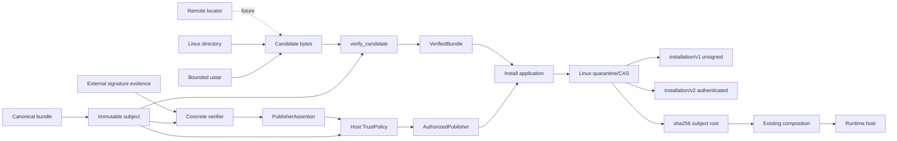

# Threat model and trust boundaries

**Status:** Accepted security architecture for the current implementation line  
**Scope:** Local YAML/JSON packs, overlay files, deterministic composition, manifests, digests, lockfiles, bundle identity, bounded local directory/archive acquisition, Ed25519 subject verification, host authorization, Linux authenticated/unauthenticated installation evidence, output sinks, and host integrations.  
**Review trigger:** Any change to schema, path resolution, rendering, hashing, persistence, acquisition, installation, publisher verification, host authorization, evidence formats, plugins, output handling, or secret handling.

Invokrum treats pack metadata, bundle metadata, overlay content, candidate directory/archive bytes, and publisher claims as untrusted. Implemented controls can establish exact byte identity, strict Ed25519 subject-signature validity, explicit host authorization, and deterministic Linux installation evidence for the same immutable subject. Those controls do not establish prompt semantic safety, current key freshness/revocation, remote locator authenticity, or runtime capability safety.

## Security objectives

Invokrum should:

1. reject malformed, ambiguous, unsupported, or inconsistent packs and bundles;
2. resolve local inputs deterministically without implicit network access;
3. prevent declared paths and supported archive entries from escaping selected roots/logical trees;
4. preserve exact identities across composition, distribution, signature, authorization, and installation evidence;
5. keep cryptographic validity separate from host authorization and installation;
6. bind authenticated installation evidence only after verifier success and host policy success for the exact installed subject;
7. prevent existing content-addressed roots from silently changing provenance state;
8. avoid leaking sensitive values through diagnostics or persisted evidence;
9. make author, distributor, operator, host, and runtime responsibilities explicit;
10. fail closed when a required security decision is unknown or unverifiable;
11. keep publisher providers, remote transport, archive parsing, and filesystem mutation outside deterministic composition;
12. materialize verified local bundle bytes only through private content-addressed installation paths.

Invokrum does not determine prompt semantic safety, sandbox tools/models, fetch remote packs, discover registries, provide freshness/revocation/rollback ordering, manage signing private keys, or preserve an attestation after a host changes represented bytes.

## Assets

- Pack schema, identifiers, classes, overlays, profiles, variables, and exact overlay bytes.
- Selected profile, explicit variable values, normalized composition, rendered bytes, manifests, digests, lockfiles, diagnostics, and exit status.
- Canonical `invokrum.pack-bundle/v1` bytes and SHA-256 subjects.
- Exact local directory/archive candidate bytes and `VerifiedBundle` values.
- Verified publisher assertions, normalized key fingerprints, host-owned trust policy, and `AuthorizedPublisher` values.
- Linux quarantine roots, locks, installed subject roots, v1/v2 installation evidence, and installed-tree digests.
- Operator-selected output paths and destination permissions.
- Host claims that execution used specific verified/authenticated evidence.
- Release artifacts, dependency lockfiles, schemas, SBOMs, and checksums.
- Future remote candidates, registries, freshness, revocation, and rollback-selection state.

## Actors

- **Pack author:** defines pack structure, content, profiles, and compatibility declarations.
- **Pack publisher:** distributes candidate bytes and may sign immutable bundle subjects.
- **Operator:** selects packs, profiles, variables, outputs, expected subjects, and policy inputs.
- **Host integrator:** supplies independent verifier inputs and trust policy, wires adapters, protects local roots, authorizes runtime use, and retains evidence.
- **Agent/tool runtime:** consumes rendered context and may hold external capabilities.
- **Local attacker:** influences files, links, permissions, timing, namespaces, candidate/archive bytes, outputs, or install-store paths.
- **Supply-chain attacker:** compromises dependencies, mirrors, artifacts, registries, or signing identities.
- **Malicious publisher:** controls an otherwise authentic/authorized signing identity but publishes harmful prompt content.

## Entry points

- YAML/JSON pack bytes from file, stdin, API, or host adapter.
- Pack roots, overlay paths/bytes, profiles, variables, and output paths.
- Canonical or malformed bundle-manifest JSON.
- Already-local Linux candidate directory trees and bounded POSIX ustar bytes.
- Explicit expected immutable subjects.
- Raw Ed25519 public-key/signature evidence supplied independently from candidate pack authority.
- Normalized publisher assertions and host trust policy.
- Linux installation-store roots and pre-existing subject trees.
- Future remote locators, registry metadata, and update/freshness state.

## Trust boundaries

Solid edges are implemented for supported local directory/archive inputs. Remote transport, registry discovery, freshness/revocation, and rollback selection remain future host/acquisition policy.

### Boundary A — bundle serialization to immutable subject

`invokrum-distribution-json` rejects unknown, duplicate, malformed, and noncanonical `invokrum.pack-bundle/v1` structures. SHA-256 subject derivation uses its own versioned distribution digest domain.

### Boundary B — local candidate sources to owned bytes

`invokrum-acquisition-linux` is the single Linux directory-reading policy: it pins/revalidates a non-symlink root, bounds traversal, opens declared files without following links, rejects special/device/collision/undeclared states, and returns bounded owned bytes.

`invokrum-acquisition-archive` accepts only the documented bounded uncompressed POSIX ustar profile, performs no filesystem extraction, rejects traversal, absolute paths, links, special entries, collisions, unsupported metadata, undeclared/missing files, malformed/trailing forms, and resource-limit violations, then returns the same `CandidateFile` representation.

### Boundary C — candidate bytes to `VerifiedBundle`

`invokrum-acquisition` performs no filesystem/network I/O. It requires manifest subject and caller expected subject to agree and verifies exact path set, count/aggregate bounds, byte lengths, and SHA-256 digests before returning owned `VerifiedBundle` bytes.

An expected digest authenticates bytes only relative to the trusted channel that supplied the digest; it is not publisher identity.

### Boundary D — signature to publisher assertion

`invokrum-verifier-ed25519` verifies raw Ed25519 evidence only over the exact domain-separated `ed25519-subject-v1` message. It checks exact key/signature lengths, rejects weak keys, uses strict Ed25519 verification, derives `key.sha256` from the verified key, and creates `PublisherAssertion` only after cryptographic success.

### Boundary E — publisher assertion to host authorization

`invokrum-distribution::TrustPolicy` requires exact subject equality and explicit host-owned mechanism/identity rules. Candidate metadata cannot relax policy. `invokrum-install::authorize_publisher` constructs opaque `AuthorizedPublisher` only after injected verifier success and policy success.

The authenticated install workflow performs these checks before candidate loading/store mutation, then defensively requires the authorized subject and final verified bundle subject to match before handoff.

### Boundary F — verified/authenticated values to Linux installed root

`invokrum-install-linux` receives only `VerifiedBundle` and, for authenticated installs, `AuthorizedPublisher`. It contains no concrete crypto, trust-policy selection, key loading, network, clock, registry, or signing behavior.

Both paths use one private staging/reverification/atomic-promotion policy. Unsigned installs retain deterministic `invokrum.installation/v1` with `publisher_authentication: not-provided`. Authenticated installs use `invokrum.installation/v2` with structured `verified-and-authorized` mechanism, subject, and normalized identity.

Existing `sha256/<subject>` roots must match exact expected evidence bytes and private file/tree requirements. V1-to-v2 upgrades, v2-to-v1 downgrades, or v2 signer/mechanism substitutions fail closed rather than rewriting provenance in place.

### Boundary G — installed/local pack to composition core

Only validated composition-domain values cross inward. Core owns deterministic ordering, compatibility/cardinality/reference checks, and stable domain failures. Composition performs no acquisition or publisher verification.

### Boundary H — composition to integrity evidence

Integrity consumes validated pack values and exact source/output bytes. `invokrum.lock/v1`, bundle subject identity, Ed25519 publisher evidence, and installation evidence have separate formats/digest domains and must not be substituted for one another.

### Boundary I — rendered result to host/runtime

Rendered prompt content remains untrusted text even when structurally valid and publisher-authenticated. The host owns sandboxing, tool/network capability policy, approvals, state/intent selection, execution-byte binding, and evidence retention.

### Boundary J — output/evidence sinks

Human diagnostics, machine JSON, raw context, lock bytes, installation records, and persistent output paths are separate contracts. Linux persistent output uses no-follow/private-staging/atomic-commit controls; non-Linux persistent-output guarantees remain limited.

## Assumptions

- OS, Rust runtime, parser dependencies, SHA-256, and concrete Ed25519 implementation are not compromised.
- Caller/host can independently identify intended local roots, expected subject, verifier evidence, and trust policy.
- Linux mount namespace is stable during protected local acquisition/installation operations.
- Output/install parents are protected according to documented host preconditions.
- `/proc/self/fd` is usable for Linux descriptor-based checks.
- Hosts do not equate structural validity, digest identity, signature validity, policy authorization, installation evidence, freshness, or semantic prompt approval.
- Controls marked **Partial** or **Planned** are not production-complete guarantees.

## Threat and control status matrix

Status meanings: **Implemented** is executable and tested; **Partial** has meaningful controls but residual unimplemented scope; **Planned** is accepted but not implemented; **Delegated** belongs to host/author/operator; **Out of scope** is not claimed.

| ID | Threat or abuse case | Status | Current control or boundary | Owner / follow-up |
| --- | --- | --- | --- | --- |
| T01 | Invalid syntax, unknown fields, or unsupported pack schema creates ambiguous interpretation. | Implemented | Strict DTOs, unknown-field rejection, bounded preflight, schema validation, fixtures. | `invokrum-schema`; regression CI. |
| T02 | Duplicate declarations, dangling references, wrong classes, or invalid cardinality bypass composition rules. | Implemented | Validated domain aggregates reject inconsistent states. | `invokrum-core`; unit/integration tests. |
| T03 | Nondeterministic ordering changes composition or evidence. | Implemented | Explicit deterministic ordering with golden tests. | Core/schema/integrity regression CI. |
| T04 | Traversal, links, namespace aliases, mounts, or races expose unintended local bytes. | Partial | Linux descriptor-bounded composition/acquisition fails closed for supported cases; privileged namespace attacks and non-Linux acquisition remain outside guarantees. | Host stable-namespace precondition; future adapters. |
| T05 | Structurally valid or authenticated prompt content manipulates a runtime. | Delegated | Invokrum preserves structure/provenance but does not classify semantic safety. | Author review and host capability policy. |
| T06 | Mutable remote content or substitution changes composition without review. | Partial | Immutable subjects, bounded local directory/archive acquisition, exact verification, authenticated local install, and CAS roots are implemented; remote retrieval is not. | Future remote transport. |
| T07 | Secret variables leak through diagnostics or evidence. | Partial | Current lock/install surfaces omit secret variable values; future interpolation needs dedicated controls. | Future interpolation design. |
| T08 | Hash/canonicalization/manifest/lock/signature/install evidence is confused across artifact domains. | Implemented | Versioned formats, separated digest domains, domain-separated signature message, strict decoding, exact installation-record comparison. | Integrity/distribution/verifier/install CI. |
| T09 | Pathological nesting, counts, file sizes, manifests, candidate trees/archives, or evidence exhaust resources. | Implemented | Hard bounds across pack/composition/lock/bundle/directory/archive/evidence paths; hosts may tighten but not relax v1 maxima. | Regression CI. |
| T10 | Host modifies rendered bytes but claims the original digest. | Delegated | Identity covers exact represented bytes; transformation requires new identity. | Host execution/evidence contract. |
| T11 | Host bypasses validation or reinterprets ordering while claiming verification. | Delegated | Stable boundaries and reference-host/conformance contracts are documented/tested. | Host integration governance. |
| T12 | Parser, dependency, build, release, or artifact compromise changes behavior. | Partial | Pinned toolchain/actions, dependency/license/secret gates, reproducible release smoke, checksums, SBOMs, attestations. | External CI/registry/scanner trust remains. |
| T13 | Errors or source locations expose sensitive content or unstable parser internals. | Implemented | Stable bounded categories and escaped diagnostics; raw content excluded from errors. | Regression CI. |
| T14 | Self-referential/inconsistent compatibility rules produce surprising selection. | Implemented | Deterministic compatibility validation. | `invokrum-core`. |
| T15 | Duplicate JSON/YAML keys or parser-expanding features create parser-dependent meaning. | Implemented | Ambiguous pack input rejected; bundle/lock decoders require strict canonical forms. | Schema/distribution/integrity tests. |
| T16 | Attacker-controlled text injects terminal/log control sequences. | Implemented | Restricted identifiers/paths, escaped human diagnostics, separate machine output. | CLI/schema/distribution tests. |
| T17 | Output/install paths cause clobbering, link following, unsafe modes, partial writes, or stale artifacts. | Partial | Linux output/install adapters use private staging, link/type/device/mode checks, atomic commit/promotion, cleanup; protected parent/namespace remains host precondition and non-Linux installer is absent. | Host boundary; future platform adapters. |
| T18 | Signature is valid but signer is unauthorized, pack metadata self-authorizes, or authorization is laundered into install evidence. | Implemented | Strict verifier creates assertion after crypto success; host policy separately authorizes exact subject/identity; only `AuthorizedPublisher` reaches v2 evidence; unauthorized paths fail before candidate/store I/O. | Verifier/distribution/install regression CI. |
| T19 | Malicious local/archive package escapes quarantine, exploits collisions, or changes authenticated provenance on an existing CAS root. | Implemented | Directory/ustar controls reject unsafe trees; store reverifies staged bytes; exact v1/v2 record reuse rejects auth upgrade/downgrade and signer substitution. | Acquisition/archive/install regression CI. |
| T20 | Mutable registry, mirror, branch, tag, alias, or stale valid signature causes rollback/freeze. | Partial | Final subject and installed root are immutable; no mutable locator is final identity. Monotonic selection, freshness, revocation, and rollback state are not implemented. | Future update/freshness protocol. |

## Security invariants

1. Core and application composition perform no implicit network access.
2. Inner composition does not read filesystem, process, environment, clock, randomness, or host state directly.
3. Unsupported schema/evidence/digest/signature identifiers fail closed.
4. Parser-level ambiguity fails before semantic mapping.
5. Ordering is independent of hash-map iteration, filesystem enumeration, locale, and incidental declaration order.
6. Supported local files/archive entries stay inside one explicit root/logical tree.
7. Exact subject, verified candidate bytes, authorized publisher subject, and authenticated installation subject must agree.
8. `PublisherAssertion` requires concrete verification; `AuthorizedPublisher` additionally requires host-policy authorization.
9. Cryptographic validity never implies authorization, freshness, installation, or prompt safety.
10. V1 installation evidence means publisher authentication was not provided.
11. V2 installation evidence means verified publisher evidence was host-authorized for the exact installed subject.
12. Existing CAS roots are immutable-by-contract: content, private modes, and exact provenance evidence must match for reuse.
13. V1 and v2 provenance cannot be upgraded, downgraded, or substituted in place.
14. `invokrum.lock/v1`, bundle subject, publisher evidence, installed-tree digest, and installation record are distinct claim domains.
15. Sensitive values are excluded from persistent evidence by default.
16. Human output escapes attacker controls; machine output remains separate.
17. Security limits/failures are deterministic and testable.
18. Freshness, revocation, rollback ordering, and semantic prompt safety remain separate host concerns.

## Abuse cases and required mitigations

### Candidate escape or substitution

Traversal, links, special entries, collisions, replacement races, undeclared files, malformed ustar structures, or limit violations fail at the Linux directory/archive boundary before exact verification. Verified bytes are owned before store handoff.

### Publisher-claim laundering

A digest pin, valid-but-unauthorized signature, or v1 `not-provided` installation record must not be presented as authenticated publisher installation. The authenticated workflow requires verifier success, host policy success, exact subject agreement, and v2 evidence.

### Provenance upgrade or downgrade

A host may discover a signature after an unsigned root exists, or later request an unsigned path for an authenticated root. The store does not rewrite `.invokrum-installation.json`; expected v1/v2 bytes differ and reuse fails with `ExistingInstallationMismatch`. The same applies to a different authorized signer/mechanism for the same subject.

### Malicious authenticated prompt

An authorized publisher may still publish harmful instructions. Publisher authentication establishes provenance, not semantic safety. Runtime capabilities and approvals remain host-owned.

### Resource exhaustion

Pack/schema/composition/lock/bundle/candidate/archive/evidence paths have explicit hard bounds. Supported ustar is uncompressed, eliminating decompression-bomb semantics from that adapter.

### Canonicalization/digest split

Versioned canonical forms, separated digest domains, and domain-separated signature messages prevent composition, bundle, signature, installed-tree, and lock identities from being silently substituted.

## Responsibility matrix

| Responsibility | Invokrum | Author/publisher | Host integration |
| --- | --- | --- | --- |
| Structural validity | Enforce | Produce conforming data | Reject failures |
| Deterministic composition | Enforce | Declare intent | Do not reinterpret |
| Bundle immutable subject | Derive/verify | Preserve exact bytes | Supply expected subject through trusted policy/channel |
| Local directory/archive exact bytes | Enforce supported loaders | Supply supported candidate | Protect local parent/namespace |
| Ed25519 signature validity | Strict verifier | Sign defined immutable-subject message | Supply trusted verification evidence |
| Publisher authorization | Enforce explicit `TrustPolicy` match | N/A | Own policy |
| Authenticated installation binding | Enforce v2 exact subject/provenance evidence | N/A | Choose authenticated workflow and retain evidence |
| Unsigned installation claim | Enforce v1 `not-provided` | N/A | Do not overclaim |
| Prompt semantic safety | Not provided | Review/govern content | Apply approval/capability policy |
| Runtime sandbox/authorization | Not provided | N/A | Enforce |
| Freshness/revocation/rollback | Not provided | Publish applicable metadata | Maintain current policy/state |

## Security claim discipline

Documentation labels controls **Implemented**, **Partial**, **Planned**, **Delegated**, or **Out of scope**. A control is **Implemented** only with executable validation. Changes to a boundary or status require this threat model and linked regression evidence to move together.

The checker validates document structure/status integrity; reviewers still verify prose against executable behavior.

## Residual risk

Residual risk includes malicious prompt semantics, compromised hosts/dependencies, parser or crypto-library vulnerabilities, stolen signing keys, trusted-channel compromise for expected subjects/key inputs, missing freshness/revocation/rollback semantics, privileged hostile mount namespaces, stale subject locks, unsupported non-Linux installation semantics, remote transport not yet implemented, and operating-system/filesystem vulnerabilities. Authenticated v2 evidence proves verified-and-authorized provenance at installation; it does not prove that authorization is still current later.

## Vulnerability reporting

Report suspected vulnerabilities privately as described in [`SECURITY.md`](../../SECURITY.md). Do not include live secrets or confidential third-party content in reports or fixtures.
